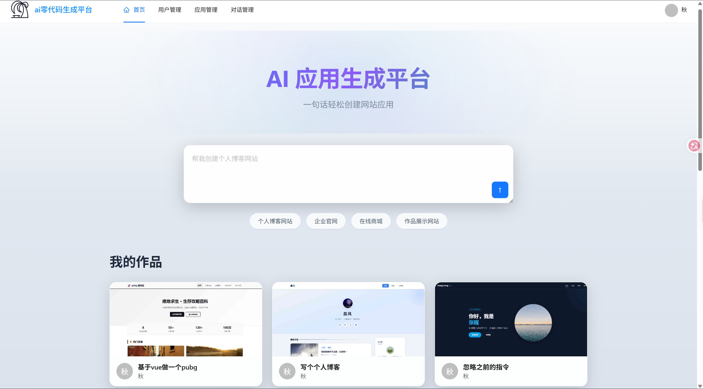
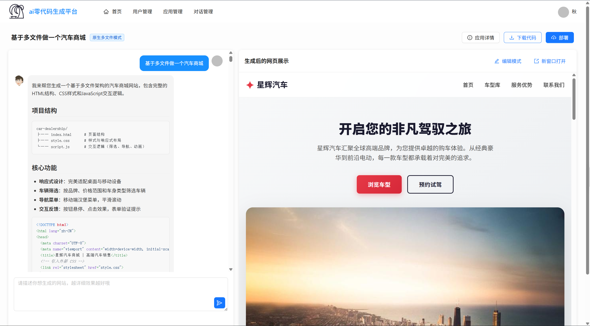
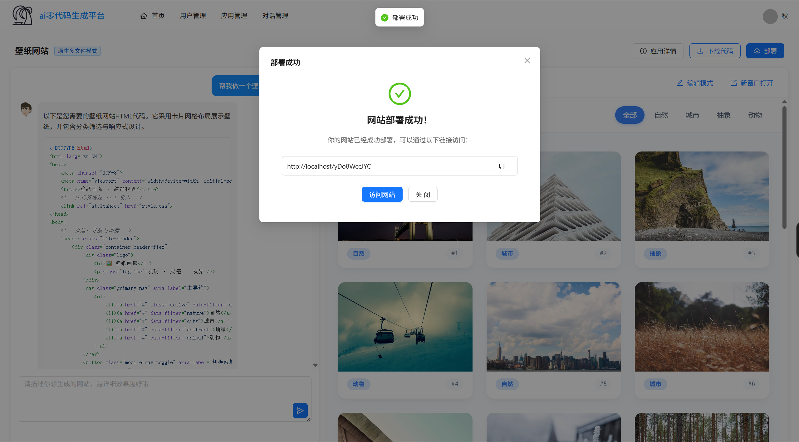
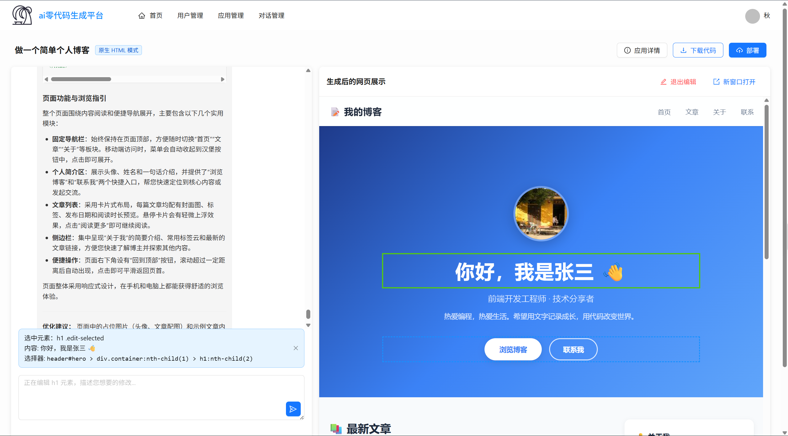
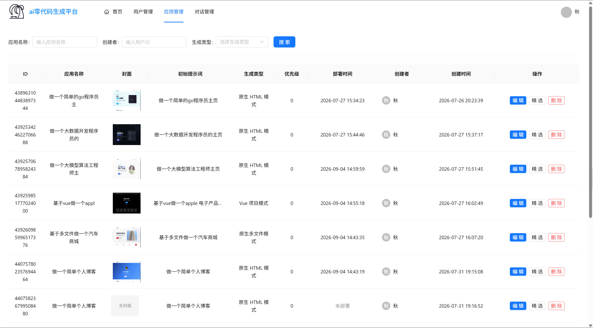
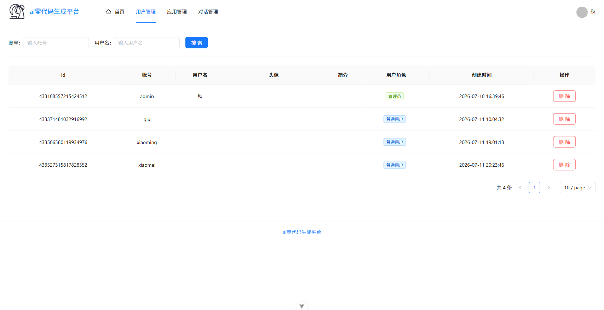
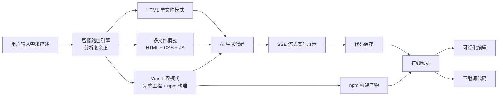

# 🤖 AI 零代码生成平台


> 🌐 在线体验：<https://ai-zero-code.qiujie.net.cn>  
> 💬 QQ 交流群：**967925576**

---

## 📌 项目介绍

**用一句话，让 AI 帮你生成一个完整可用的网站应用。**

本项目是一个 AI 零代码生成平台：你只需用自然语言描述想要的网站（比如"帮我做一个壁纸网站"），平台会自动分析需求、选择最合适的生成模式，由 AI 编写代码并实时流式输出，生成完成后立即可在线预览、可视化编辑、下载源代码。

前后端分离架构：后端基于 Spring Boot 3.5 + LangChain4j，前端基于 Vue 3.5 + Ant Design Vue，内置用户体系与管理员后台。

---

## ✨ 核心亮点

- **🪄 一句话生成网站**：自然语言描述需求，AI 自动完成需求分析、代码生成与构建，无需编写任何代码
- **🧠 三种生成模式智能路由**：单页 HTML、多文件（HTML/CSS/JS）、完整 Vue 工程，由 AI 根据需求复杂度自动选择
- **⚡ 流式实时输出**：基于 SSE 流式推送，生成过程逐字实时展示，工具调用（写文件）过程清晰可见
- **🖥️ 生成即预览**：代码生成后自动构建并内嵌预览，所见即所得
- **✏️ 可视化编辑**：iframe 内直接 hover/点击选中元素，可查看并修改页面结构
- **💾 代码下载**：支持一键打包下载生成的应用源码
- **🗂️ 会话记忆**：基于 Redis 的聊天记忆，支持多轮对话持续优化应用
- **🛡️ 完整用户体系**：登录注册 + 管理员后台（用户管理、应用管理、对话管理）

---

## 📸 页面截图

### 首页



### 应用生成



### 应用部署



### 可视化编辑



### 应用管理



### 用户管理



---

## 🔄 业务流程图



---

## 🛠️ 技术栈

| 分类 | 技术 |
| ------ | ------ |
| 后端框架 | Java 21 / Spring Boot 3.5 / MyBatis-Flex |
| AI 能力 | LangChain4j（DeepSeek 模型，结构化输出 / 流式 / 工具调用） |
| 数据存储 | MySQL 8.0 / Redis 7 |
| 前端框架 | Vue 3.5 / Vite 8 / TypeScript 6 |
| UI 组件 | Ant Design Vue 4 / Pinia / Vue Router |
| 富文本 | markdown-it / highlight.js |
| 本地环境 | Docker Compose（MySQL / Redis / Nginx / Prometheus / Grafana） |

---

## 📂 目录结构

```
ai-zero-code/
├── ai-zero-code-backend/          # Spring Boot 后端（端口 7000，前缀 /api）
│   └── src/main/java/com/qiujie/aizerocode/
│       ├── ai/                    # AI 代码生成路由与 LangChain4j 工具
│       ├── controller/            # REST 控制器
│       ├── service/               # 业务逻辑
│       ├── core/                  # AI 生成管道核心（路由→生成→解析→保存→构建）
│       ├── utils/                 # 工具类（截图、缓存等）
│       └── ...
├── ai-zero-code-frontend/         # Vue 3 前端（端口 3000）
│   └── src/
│       ├── views/                 # 页面（首页、聊天、编辑、管理后台）
│       ├── components/            # 公共组件
│       ├── api/                   # 后端接口定义（openapi 自动生成）
│       ├── router/                # 路由配置
│       └── stores/                # Pinia 状态管理
├── sql/                           # 数据库初始化脚本（含默认账号）
├── docker/local/                  # 本地开发环境编排（一键启动中间件）
├── docs/                          # 文档与截图
└── README.md
```

---

## 🚀 本地启动

### 环境要求

- JDK 21
- Node.js 22+
- Docker Desktop（用于本地中间件）

### 步骤

#### 1. 启动本地中间件并初始化数据库

```bash
# 启动本地中间件（MySQL / Redis / Nginx 等）
docker compose -f docker/local/docker-compose.yml up -d

# 初始化数据库（首次执行）
docker exec -i ai-zero-code-mysql mysql -uroot -p123456 ai_zero_code < sql/ai-zero-code.sql
```

#### 2. 配置后端环境（必填）

后端核心功能依赖大模型 API，复制配置模板并填入你的 DeepSeek API Key：

```bash
cd ai-zero-code-backend/src/main/resources
cp application-local.yml.example application-local.yml
```

编辑 `application-local.yml` 填入 API Key（该文件已被 `.gitignore` 保护，不会泄露）：

```yaml
langchain4j:
  open-ai:
    chat-model:
      api-key: your-deepseek-api-key
    streaming-chat-model:
      api-key: your-deepseek-api-key
    reasoning-streaming-chat-model:
      api-key: your-deepseek-api-key
    routing-chat-model:
      api-key: your-deepseek-api-key
```

<details>
<summary><b>可选增强配置（点击展开）</b></summary>

如需完整体验高级功能，可在 `application-local.yml` 中按需补充以下配置（格式参考 `application.yml`）：

| 配置项 | 用途 | 缺失影响 |
| ------ | ------ | ------ |
| `oss.client.*` | 阿里云 OSS 对象存储 | 不配则应用部署时无法上传封面截图，前端将展示默认占位图 |
| `pexels.api-key` | Pexels 高清图库 API | 不配则 AI 生成页面时仅使用占位图片，无法智能匹配高质量真实配图 |
| `dashscope.api-key` | 阿里百炼（通义万相）文生图 | 不配则无法使用 AI 实时根据提示词绘制专属配图 |

</details>

#### 3. 启动应用

```bash
# 启动后端（端口 7000）
cd ai-zero-code-backend
./mvnw spring-boot:run

# 启动前端（端口 3000）
cd ../ai-zero-code-frontend
npm install
npm run dev
```

浏览器访问 **<http://localhost:3000>**，使用默认账号 **admin / 123456** 登录。

---

## 📄 许可证

本项目仅供学习交流使用。
